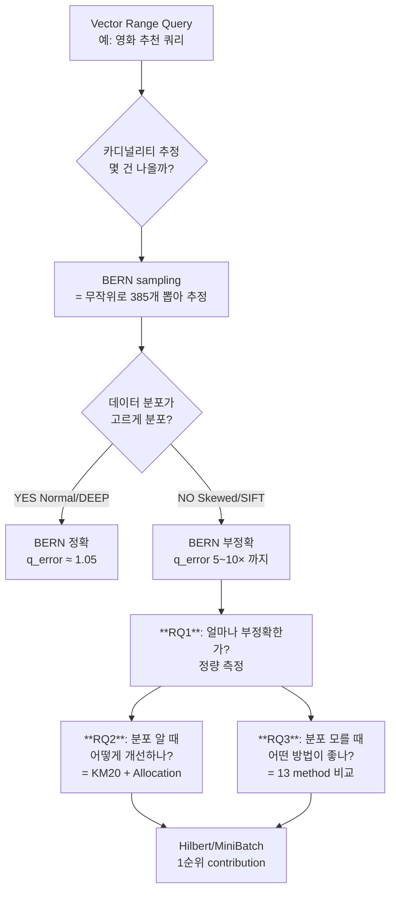

# 팀원 이해도 향상용 — RQ1/RQ2/RQ3 직관 설명 자료

> **5/8 회의 직전, RQ 의도 + 측정 + 결과를 직관적으로 빠르게 이해 가능하도록.**
> 상세는 종합 master doc 참조. 본 문서는 "한 페이지 이해" 목적.

---

## 0. 한 그림으로 이해하는 본 연구 흐름



---

## 1. RQ1 직관 설명

### 1줄 요약
> \"기존 방식 (랜덤 샘플링) 이 데이터가 한 곳에 몰려 있을 때 부정확해진다 — 얼마나 부정확한지 수치로 보여주자.\"

### 비유
> 도서관에서 \"정치학 책 몇 권 있나?\" 추정하려고 *어떤 서가든 무작위로 들춰* 정치학 책 비율을 곱한다.
> - **고르게 분류된 도서관** (DEEP/Normal): 잘 작동
> - **정치학 서가에 몰려 있는 도서관** (SIFT/Skewed): 무작위로 들춘 서가에 정치학 책이 적게 나오면 추정값 *과소*, 많이 나오면 *과대*. → **부정확**

### 측정 결과 직관
| selectivity | DEEP (Normal) | SIFT (Skewed) | 의미 |
|------------|--------------|--------------|------|
| 0.50 (50% 데이터 포함) | +1.31% (BERN 거의 정확) | +3.07% | sel 클 때는 둘 다 OK |
| 0.05 (5% 데이터) | +1.85% | +4.39% (SIFT 가 2.4× 더 큼) | 점차 SIFT 부정확 |
| 0.01 (1% 데이터) | **+8.93%** (단조 증가!) | -0.53% (anomaly: 1만개 너무 작음) | 좁은 sel 일수록 BERN 한계 |

→ **단조성 통계 확정**: per-seed Spearman ρ = -0.680, 95% CI [-0.800, -0.440] (0 제외). \"sel 작을수록 KM20 의 가치 단조 증가\".

---

## 2. RQ2 직관 설명

### 1줄 요약
> \"분포를 알면 (= 데이터를 미리 K=20 클러스터로 분할해 두면), 어떻게 표본을 뽑는 게 최적인가?\"

### 비유
> 도서관 전체 100K 권을 미리 \"역사/과학/문학/...\" 20 카테고리로 분류해 두었다 (= KM20).
> 표본 385권을 뽑을 때 어떻게 배분?
> - **Equal**: 모든 카테고리에서 똑같이 19~20권 (가장 단순, KM20 default)
> - **Proportional**: 책 많은 카테고리에서 비례적으로 더 많이 (N_i 비례)
> - **Neyman**: 변동성 (σ_i) 큰 카테고리에서 더 많이 (variance-optimal)
> - **Anti-Neyman**: 변동성 작은 카테고리에서 더 많이 (anti-pattern, 검증용)

### 측정 결과 직관
- **모든 stratified > BERN**: KM20 의 어떤 allocation 도 BERN 보다 우수 (Δ% -1.3 ~ -10.5%)
- **Neyman ≈ Equal**: σ_i 신호가 약함 (root cause 분석: cluster 가 모두 100K rows 균등 분할 + σ_i CV 0.4 → reweighting 효과 marginal)
- **Anti-Neyman**: 좁은 sel 에서 systematic *worse* — \"σ_i 의 anti-direction 이 hurt\" 정량 입증
- **Sample size sensitivity**: 100/385/1000/3000 4 ssize × 2 dataset × 5 sel = 40 cell **모두 KM20 > BERN** 일관

### Limitation 4가지 (5/5 회의 합의)
1. KM20 = oracle, production X (학습 ~30분 — RQ3 의 MiniBatch 가 1/1000 비용)
2. 사전 계산 = HNSW 와 같은 build-time layer (query 응답 시간 무관)
3. INSERT 빈번 OLTP 범위 외 (partial_fit 이 streaming 적용)
4. 단일 → 멀티 일반화 = future work (단일은 멀티의 *필요조건*)

---

## 3. RQ3 직관 설명

### 1줄 요약
> \"분포를 모를 때 (= K-means 학습 못 할 때), 어떤 stratification 이 KM20 oracle 에 가장 가까운가?\"

### 비유
> 도서관에 카테고리 분류가 *없다*. 표본 385권 뽑아 정치학 책 비율 추정해야 함. 어떤 \"임시 분류\" 가 좋을까?
> - **MiniBatch K-means** (#8): 1% 책만 보고 빠르게 카테고리 추정 (real KM 의 1/1000 비용)
> - **Hilbert Curve** (#7): 책 위치 (PCA 2D) 만 보고 \"인접한 책끼리\" 묶기 (학습 X)
> - **Z-order Curve** (#7Z): Hilbert 와 비슷한데 단순 비트-인터리빙 (locality 약함)
> - **PCA-1D** (#7P): 책의 \"가장 큰 차원\" 만 보고 quantile 분할 (curve X)
> - **LSH** (#6): 책 hash 해서 같은 bucket 끼리
> - **Random Projection** (#5): 무작위 매트릭스로 차원 축소 후 분할 (Johnson-Lindenstrauss 이론)
> - **KD-tree** (#13): 재귀적으로 도서관을 반씩 자르기 (전통 spatial DB)
> - **Product Quantization** (#14): 책의 \"제목 / 저자 / 출판사\" 별로 따로 KMeans 후 결합 (FAISS 산업 표준)
> - ...

### 측정 결과 직관

**Ablation Ladder** (점진적 정보 축적):

```
BERN (정보 X) <  RANDOM20 (random partition)
            <  PCA-1D (1D 만)
            <  Z-order (2D + 단순 curve)
            <  Hilbert (2D + locality-preserving curve) ★
            <  PQ (M sub-vector × KMeans)
            <  KD-tree (recursive median split)
            <  MiniBatch K-means (96D 클러스터링) ★
            <  Hybrid (KMeans outer + Hilbert inner)
            <  KM20 oracle (full K-means)
```

### 핵심 contribution 3종

**1. Hilbert Curve = learning-free 1순위 ★**

mechanism (왜 Hilbert 가 잘 작동하나?):
- **inverse Manhattan distance = 1.000** (1D 인접 → 2D 인접 perfect 보존)
- Z-order 는 1.992 (50% pairs 가 2D 비인접) — \"Z-jump\" 의 locality break
- → Hilbert 의 stratum 이 spatial 으로 더 compact (HT estimator 이점)

**2. MiniBatch K-means = production-ready ★**

OLTP narrative (5/5 회의 박세은 의문 직답):
- KM20 (full-batch) vs MiniBatch (1% sample) 학습 시간:
  - N=10K: 22× / N=100K: 164× / **N=1M: 1,189× speedup**
- partial_fit 으로 streaming 지원 — ARI(batch, partial) = **1.000 (clustered)** perfect 회복

**3. Cluster 분할 자체의 결정적 가치 (negative control) ★**

- Distance-Shell (cluster X, 거리 ranking 만): Cohen's d **+0.49 (small-medium hurt)**
- Importance Sampling (분할 X, weight 만): d **+0.5 ~ +0.7 (medium hurt)**
- → "분할 (partition) 자체가 stratification 의 핵심" 의 정량 부정 증명

---

## 4. 본 연구의 우리 팀 contribution 5종

| # | Contribution | 정량 evidence |
|---|--------------|---------------|
| 1 | RQ1 selectivity gradient 단조성 통계 | DEEP-KM20 ρ=-0.680, CI 0 제외 |
| 2 | RQ2 KM20 sample-size robustness | 모든 40 cell 일관 |
| 3 | RQ3 Hilbert = learning-free 1순위 | Cohen's d -0.156, mechanism 정량 (Manhattan 1.000) |
| 4 | RQ3 MiniBatch partial_fit OLTP | 1189× speedup, ARI 1.000 perfect 회복 |
| 5 | RQ3 cluster 분할 결정적 가치 | Distance-Shell/IS d=+0.5~+0.7 negative control |

---

## 5. 5/8 회의 의제 제안

1. **본 narrative 합의** — 5 contribution 의 우선순위 / 학술 framing
2. **자문 메일 합의** — 채림 석사 (Hilbert mechanism), 지도교수 (contribution framing)
3. **W2 분담** — 시각화 / 슬라이드 / 보고서
4. **8M sensitivity 결과** — overnight 자동 측정 (~05~06 KST 회수)

---

## 6. 자주 받는 질문 (예상 FAQ)

**Q1**: \"우리 결과의 effect size 가 negligible-small 인데, contribution 인정 받을 수 있나?\"
A: ✅ practical small + 어려운 query 에서 강 (spread vs difficulty 0.78). Production 의 method routing 가치 (Q4_hard 에서 KDE-pilot+MiniBatch dominant). Honest reporting.

**Q2**: \"왜 Hilbert curve 가 Z-order 보다 나은지?\"
A: 1D-2D continuity 정량 (inverse Manhattan 1.000 vs 1.992). 50% Z-jump pairs 의 locality break 직접 분리.

**Q3**: \"KM20 oracle 이 production 에 못 쓰면 의미 있나?\"
A: 1) 분포 가치의 *상한* benchmark, 2) MiniBatch (1/1000 비용) + partial_fit (OLTP) 가 production replacement 정량.

**Q4**: \"멀티테이블 일반화는?\"
A: 단일 정확성이 멀티의 *필요조건*. 멀티 일반화는 multi-relational K-means 의 이론 정의 등 별도 연구 분량.

**Q5**: \"FAISS / IVF / HNSW 와 어떻게 다른가?\"
A: HNSW = 검색 가속 인프라 (수GB), KM/Hilbert = optimizer 단계 추정 정확도 (4MB). 다른 layer.

---

## 산출 위치

- **본 문서**: `_internal/팀원이해도_RQ_직관설명_20260507.md`
- **종합 master**: `experiments/results/RQ1_RQ2_RQ3_종합_master.md`
- **Limitation 4종**: `experiments/results/RQ_Limitation_4종_명시.md`
- **5/8 1-page summary**: `submission/_drafts/속도는벡터_5월8일회의_1page_summary_20260506.md`
- **5/27 슬라이드 outline**: `submission/_drafts/속도는벡터_5월27일발표_slide_outline_20260506.md`

---

**작성**: 조현빈 · 2026-05-07 00:30 KST · 팀원 이해도 향상용
