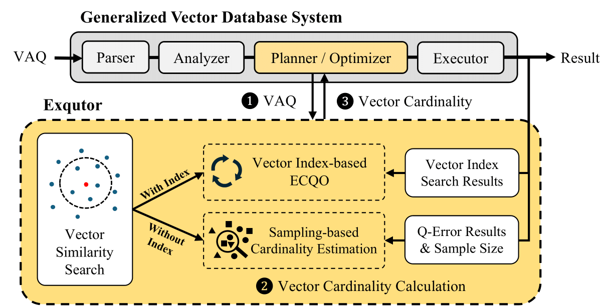

<div align="center">
  <h1>
    &nbsp; Exqutor: Extended Query Optimizer for Vector-augmented Analytical Queries (ICDE'26)
  </h1>
</div>
  
**Exqutor** is an **extended query optimizer** designed to improve **vector-augmented analytical queries (VAQs)** by enhancing cardinality estimation in vector search operations. With the rise of **Retrieval-Augmented Generation (RAG)** and **table-augmented generation**, modern analytical workloads increasingly integrate structured relational data with vector similarity searches. However, existing database optimizers struggle with **inaccurate cardinality estimation** for vector search operations, leading to inefficient query execution plans.

## System Design
- **Exact Cardinality Query Optimization (ECQO)**: Leverages vector indexes (e.g., HNSW, IVF) to retrieve exact cardinality estimates during query planning.
- **Adaptive Sampling-Based Cardinality Estimation**: Dynamically adjusts the sample size to improve accuracy for queries without vector indexes.
- **Seamless Integration**: Implemented in **PostgreSQL** and **DuckDB**, demonstrating performance improvements of up to **three orders of magnitude** in vector-augmented analytical queries.
- **Optimized for Vector-Augmented SQL Analytics**: Supports complex **joins, aggregations, and filters** alongside vector similarity search.

<div align="center">
  
</div>

## Getting Started

### Download datasets

```sh
cd Vector-augmented_SQL_analytics
./download_dataset.sh
```

### Execution

#### pgvector + Exqutor

1. Install pgvector + Exqutor

```sh
cd PostgreSQL/pgvector
./apply_patch.sh
./build.sh
```

2. Setup Vector-augmented_SQL_analytics

tpc-h

```sh
cd Vector-augmented_SQL_analytics/tpc-h
./insert_data_pgvector.sh
```

3. Execute queries

```sh
cd Vector-augmented_SQL_analytics/tpc-h/codes
python query_pgvector.py
```

#### VBASE + Exqutor

1. Install VBASE + Exqutor

```sh
cd PostgreSQL/VBASE
./apply_patch.sh
./build.sh
```

2. Setup Vector-augmented_SQL_analytics

```sh
cd Vector-augmented_SQL_analytics/tpc-h
./insert_data_vbase.sh
```

3. Execute queries

```sh
cd Vector-augmented_SQL_analytics/tpc-h/codes
python query_vbase.py
```

#### DuckDB

1. Install DuckDB-VSS
```sh
cd DuckDB/duckdb-vss
make
```

2. Setup Vector-augmented_SQL_analytics

```sh
cd Vector-augmented_SQL_analytics/tpc-h
./insert_data_duckdb.sh
```

3. Execute queries
```sh
cd DuckDB/duckdb-vss/build/release
./duckdb ./tpch 
```
