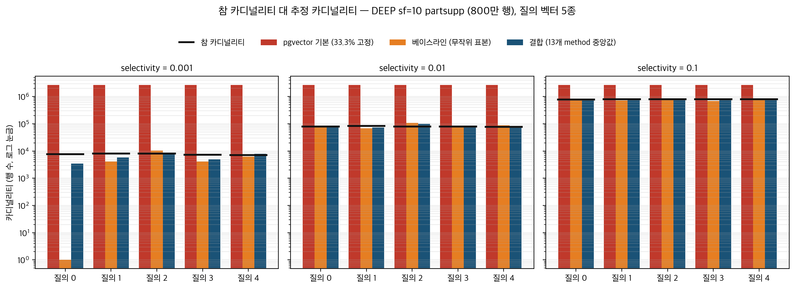
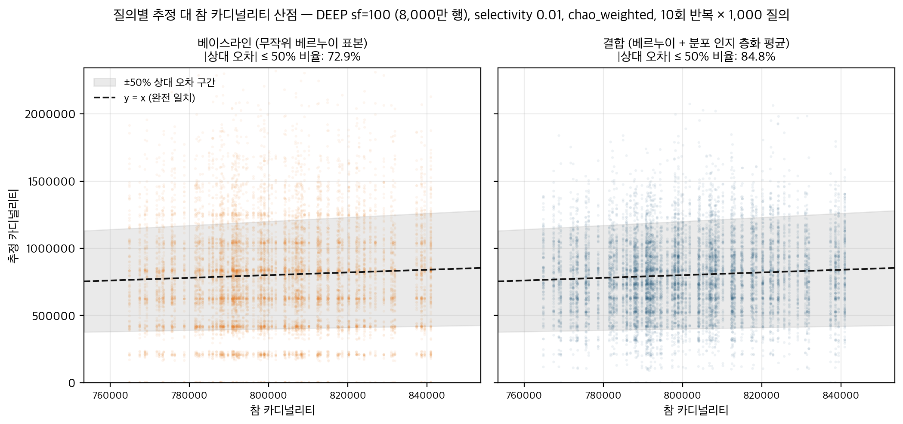
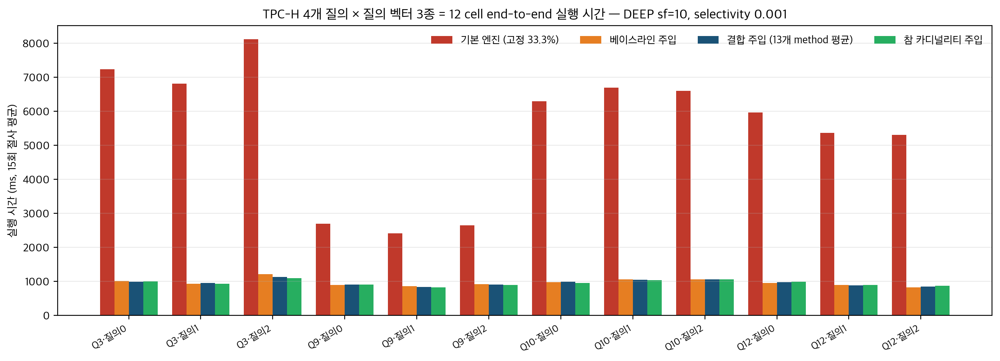

# Vector-augmented Analytical Query에서 인덱스 부재 시 Adaptive Sampling 개선

**팀: 속도는벡터** (연세대학교 컴퓨터과학과 종합설계 · 지도교수 박광현 · 지도연구원 임채림 · 산학멘토 박성원)

---

## 요약 (Abstract)

벡터 증강 분석 질의(vector-augmented analytical query)에서 벡터 인덱스가 없을 때, 상용 시스템은 벡터 술어의 카디널리티를 데이터와 무관한 고정 비율로 추정하여 비효율적인 실행 계획을 만든다. 선행 연구 Exqutor[1]는 무작위 베르누이 표본 추출에 기반한 적응적 표본 추출(adaptive sampling)로 이 문제를 보완하였다. 본 연구는 그 추정 파이프라인에서 표본을 뽑는 단계 하나만을 데이터 분포 인지 층화 표본 추출(stratified sampling)로 바꾸는 단일 개입의 효과를 측정으로 검증한다. 일곱 가지 패러다임의 표본 선택 method 16종을 다섯 데이터셋 × 세 selectivity × 세 scale factor × 세 계층 수에 걸쳐 교차한 1,508건의 3-way 대응 측정(베이스라인·단독 방식·결합 방식)을 수행한 결과, 두 추정값을 산술 평균하는 결합 방식은 베이스라인 대비 89.1%(1,344/1,508건)의 측정에서 추정 오차를 낮추었고(중앙값 −4.38%), 단독 방식은 35.2%에 그쳐 불안정하였다. 결합 추정값을 패치된 PostgreSQL 엔진에 주입한 12 cell × 16 variant × 15회 = 2,880회의 실행 시간 측정에서는 고정 비율 추정 대비 평균 5.67배의 가속과 94.9%의 최적 계획 회복이 확인되었으나, 베이스라인 대비 실행 시간의 추가 단축은 관측되지 않았다. 추가 통제 실험은 결합 방식의 정확도 개선이 분포 인지 자체보다 두 독립 추정량을 평균하는 일반 통계 효과에서 비롯됨을 보였다. 본 연구는 표본 선택 개입의 효과와 한계를 통제 실험으로 정량 규명한 검증 중심(verification-oriented) 연구이다.

---

## 1. 서론 (Introduction)

이미지·문서·음성과 같은 비정형 데이터를 의미 기반으로 검색하려는 수요가 증가하면서, 데이터를 고차원 실수 벡터(임베딩)로 표현하고 벡터 간 거리로 유사도를 판정하는 벡터 검색이 검색 증강 생성(retrieval-augmented generation)[5]을 비롯한 응용의 핵심 기반이 되었다. 동시에 이러한 벡터를 전통적인 관계형 데이터베이스 관리 시스템(relational database management system, RDBMS)과 통합하려는 수요도 커져, pgvector[2]·VBASE[3]·DuckDB[4]와 같은 시스템이 SQL 질의 안에서 벡터 유사도 조건을 함께 처리한다.

이러한 질의를 효율적으로 실행하려면 쿼리 옵티마이저가 최적 실행 계획을 생성해야 하고, 그 전제는 각 연산이 몇 개의 행을 반환할지를 뜻하는 카디널리티(cardinality) 추정이다. 카디널리티 추정이 틀리면 조인 순서·조인 알고리즘·인덱스 사용 여부의 선택이 연쇄적으로 어긋나 질의 실행 시간이 크게 늘어난다.

벡터 인덱스가 있는 경우에는 HNSW(Hierarchical Navigable Small World)[6]와 같은 그래프 구조 위에서 거리 임계값 이내의 항목 수를 빠르고 정확하게 셀 수 있다. 그러나 인덱스가 없는 상황에서는 그러한 구조를 쓸 수 없으므로 추정에 의존해야 한다. 상용 시스템들은 질의와 무관하게 테이블의 일정 비율이 반환된다는 고정값을 사용하는데, 실제 카디널리티는 그보다 수백 배 작을 수 있어 매우 부정확하며 실행 시간을 불필요하게 늘리는 요인이 된다(§5.1). 이에 표본 추출(sampling)로 데이터의 일부만 확인하여 전체 분포를 추정하고 카디널리티를 계산하는 방식이 제안되었고, 선행 연구 Exqutor[1]가 그 대표이다.

그런데 이 방식은 무작위 표본 추출(random sampling)에 기반한다. 본 연구는 데이터 분포가 고른 경우에는 무작위 표본이 잘 작동하지만, 분포가 쏠린(skewed) 경우에는 표본의 대표성이 떨어져 추정이 흔들릴 수 있다고 의심하였다. 그래서 표본 통계학의 분포 인지 층화 표본 추출을 비롯한 여러 표본 선택 방식을 도입하여, 무작위 표본보다 나은 방식이 존재하는지를 측정으로 확인하고자 한다. 본 연구의 방법은 여러 표본 선택 방식을 같은 조건에서 비교하여 성능을 확인하는 것이고, 목표는 더 정확한 카디널리티 추정을 만드는 표본 선택 방식을 찾는 것이다.

## 2. 배경 (Background)

### 2.1 벡터 증강 분석 질의 (Vector-augmented Analytical Query)

기존의 관계형 데이터베이스는 테이블 형식의 정형 데이터를 저장하고 관리한다. 그러나 이미지나 문서처럼 의미 비교가 필요한 데이터를 다루려면, 임베딩 모델을 거쳐 의미적으로 유사한 항목일수록 벡터 공간에서 가까워지는 고차원 실수 벡터로 변환해 저장한다. pgvector[2]와 같은 확장(extension)은 이러한 벡터 컬럼과 거리 연산자를 전통 RDBMS에 통합하여, 벡터 유사도 조건이 SQL의 조인·집계·필터와 결합된 벡터 증강 분석 질의(vector-augmented analytical query, 이하 VAQ)를 가능하게 한다. 문제는 벡터 거리 조건이 들어오는 순간 전통적인 히스토그램·통계 기반 카디널리티 추정이 작동하지 않는다는 점이다 — 고차원 거리 술어의 선택도(selectivity, 전체 행 가운데 조건을 만족하는 행의 비율)는 1차원 통계로 요약되지 않기 때문이다.

### 2.2 카디널리티 추정과 쿼리 옵티마이저

카디널리티 추정이 필요한 까닭은 쿼리 옵티마이저가 최적 실행 계획을 세울 때 각 연산의 출력 행 수가 비용 계산의 입력이 되기 때문이다. 벡터 인덱스가 있는 경우에는 HNSW[6]처럼 근접 이웃 그래프를 구성해 두면 거리 임계값 이내의 행 수를 1–2ms 수준의 범위 질의로 정확히 셀 수 있다. 그러나 인덱스가 없는 경우에는 데이터셋의 분포를 미리 알 수 없으므로 정확한 답을 얻으려면 전체 탐색이 필요한데, 추정을 위해 전체를 읽는 것은 실행 자체보다 비쌀 수 있어 비현실적이다.

### 2.3 인덱스가 없는 상황에서의 카디널리티 추정

상용 시스템들은 인덱스가 없을 때 반환될 카디널리티에 고정 비율을 사용한다. pgvector는 거리 조건이 테이블 행 수의 33.3%를 반환한다고 항상 추정하고, VBASE는 50%, DuckDB는 100%를 가정한다[1]. 실제 선택도는 0.1% 이하로 내려가는 경우가 흔하므로 이 고정 비율은 수백 배의 과대 추정이 되며(§5.1의 실측에서 최대 373배), 옵티마이저가 순차 탐색과 비효율적 조인 순서를 고르게 만든다. 그래서 Exqutor는 표본 추출을 한다 — 전체에서 일부만 뽑아 거리 조건을 검사해 보고, 그 표본 내 비율을 토대로 전체의 카디널리티를 추정하는 것이다.

### 2.4 선행 연구 Exqutor

Exqutor[1]는 인덱스가 있는 경우와 없는 경우를 모두 다룬다. 인덱스가 있으면 정확 카디널리티 질의 최적화(Exact Cardinality Query Optimization, ECQO)가 HNSW 범위 질의로 사실상 정확한 값을 얻는다. 인덱스가 없으면 무작위 베르누이 표본 추출(Bernoulli random sampling)에 기반한 적응적 표본 추출(Adaptive Sampling)을 수행하는데, 추정값과 참값의 비율로 정의되는 Q-error를 피드백 삼아 모멘텀(momentum) 기반으로 표본 크기를 동적으로 조정하며 점점 정확한 추정을 만들어 가는 방식이다. 그 절차는 다음 여섯 식으로 기술된다[1].

```
식 1:  N = ⌈z²·P̂(1−P̂)/e²⌉ = 385          (초기 표본 예산; z=1.96, P̂=0.5, e=0.05)
식 2:  q = max(C_est/C_true, C_true/C_est)   (Q-error 정의)
식 3:  δ = α·(q − β) − (100−α)·p             (조정 계수; α=50, β=1.5, p=표본 비율)
식 4:  V_t = m·V_{t−1} + η_t·δ               (모멘텀 항 갱신; m=0.9)
식 5:  N_{t+1} = N_t + V_t                   (표본 크기 갱신)
식 6:  η_{t+1} = γ·η_t                       (학습률 감쇠; γ=0.99)
```

식 1은 모비율 P̂=0.5, 신뢰계수 z=1.96, 허용 오차 e=0.05를 표본 크기 공식에 대입한 초기 표본 예산 385이다. 식 2의 Q-error가 목표값 β=1.5보다 크면 식 3–5가 표본 크기를 늘리고, 식 6이 학습률을 점진적으로 줄여 진동을 억제한다. 전체 절차는 매 50 질의 주기마다 작동하며 m=0.9, η₀=0.1, α=50, β=1.5, γ=0.99, 갱신 주기 50, N=385의 일곱 하이퍼파라미터로 완전히 규정된다. 본 연구는 이 식 1–6과 하이퍼파라미터를 변경 없이 그대로 사용하고, 오직 "어떤 표본을 뽑을 것인가"라는 표본 선택 단계만을 개입 지점으로 삼는다.

## 3. 제안 방법 (Proposed Method)

### 3.1 비교 구도 — 베이스라인·단독 방식·결합 방식

본 연구의 측정은 세 가지 방식을 같은 조건에서 짝지어 비교한다. **베이스라인**은 Exqutor 논문 그대로의 무작위 베르누이 표본 추출이다. **단독 방식**은 베르누이 표본을 아래 3.3의 분포 인지 표본 선택 method가 뽑은 표본으로 통째로 치환하여 method 추정값만 사용하는 방식이다. **결합 방식**은 베르누이 추정값과 method 추정값을 산술 평균하여 사용하는 방식이다(추정값 = (베르누이 추정값 + method 추정값) / 2). 세 방식 모두 식 1의 표본 예산 N=385와 식 2–6의 모멘텀 보정을 동일하게 사용하므로, 방식 간 추정 오차의 차이는 오직 표본 선택의 차이로 귀속된다.

사전 측정에서 단독 방식은 method에 따라 추정이 크게 좋아지기도 나빠지기도 하는 불안정성을 보였고(§5.3), 이에 본 연구는 결합 방식을 주 실험군으로 채택하였다. 단독 방식은 결합의 가치를 거꾸로 입증하는 음성 대조군(negative control)으로 측정에 계속 포함한다.

### 3.2 분포 인지 층화 표본 추출의 이론적 토대

표본 통계학은 모집단을 성질이 비슷한 부분집단인 계층(stratum)으로 나눈 뒤 각 계층에서 표본을 뽑는 층화 표본 추출이, 계층 내부가 동질적일수록 추정량의 분산을 단순 무작위 추출보다 줄여 준다는 사실을 고전적으로 정립하였다(Cochran[7], 5장). 계층별 표본 배분은 계층별 표준편차에 비례시키는 네이만 배분(Neyman allocation)[8]이 이론적 최적이나, 표준편차의 사전 추정을 요구한다. 본 연구는 추가 통계량을 요구하지 않는 견고한 기본값인 균등 배분(equal allocation)을 사용한다 — K=20개 계층에 표본 예산 385를 같은 수로 나누어 뽑는다. 계층을 만드는 비용은 데이터셋이 적재될 때 한 번 치르는 오프라인 비용이며, 질의 시점의 표본 예산은 한 건도 늘지 않는다.

### 3.3 표본 선택 method — 일곱 패러다임, 16종

벡터 데이터에서 계층을 만드는 방법은 군집화·공간 분할·차원 축소 등 여러 갈래가 있다. 본 연구는 특정 알고리즘 계열에 결론이 좌우되지 않도록 일곱 패러다임에서 16종 method를 선정하였다. method 명칭은 구현 실태를 명칭에 정직하게 반영하는 원칙에 따라 표기한다 — 예컨대 고차원 힐베르트 곡선이 아니라 주성분 분석으로 2차원 환원한 뒤 힐베르트 곡선을 적용하는 구현은 `pca2d_` 접두어를 명시한다. 표 1이 전체 목록이고, 이어지는 본문이 패러다임별로 설명한다.

**표 1. 표본 선택 method 16종 요약.** 분포 파악 시간은 1,508건 측정에서의 평균 fit 시간(초·오프라인 1회 비용)이다.

| method (보고서 표기) | 측정 코드 명칭 | 패러다임 | 핵심 아이디어 | 분포 파악 시간(s) |
|---|---|---|---|---:|
| gmm | gmm | P1 군집화 | 가우스 혼합 모형의 성분 = 계층 | 29.6 |
| minibatch_partial | minibatch_partial | P1 군집화 | 미니배치 k-평균 군집 = 계층 | 17.0 |
| pca2d_hilbert_xy2d | hilbert_real | P2 공간 분할 | PCA 2차원 + 힐베르트 곡선 순서로 등분 | 40.7 |
| pca4_skilling_hilbert_approx | skilling_hilbert | P2 공간 분할 | PCA 4차원 + Skilling 힐베르트 근사 | 53.9 |
| pca2d_zorder_morton | zorder_morton | P2 공간 분할 | PCA 2차원 + Z-순서 곡선 | 24.6 |
| faiss_ivf | faiss_ivf | P2 공간 분할 | FAISS 역색인 파일(IVF) 군집 셀 = 계층 | 17.8 |
| chao_weighted | chao_weighted | P3 스트리밍 | 단일 패스 가중 불균등 확률 표본 | 11.0 |
| pca1d | pca1d | P4 차원 축소 | 제1주성분 사영값 구간 등분 | 15.9 |
| ica_fastica | ica_fastica | P4 차원 축소 | FastICA 독립 성분 사영 후 등분 | 20.9 |
| rsvd | rsvd | P4 차원 축소 | 무작위화 SVD 저랭크 사영 후 등분 | 6.9 |
| sparse_rp | sparse_rp | P4 차원 축소 | 희소 무작위 사영 후 등분 | 2.9 |
| cum_sqrtf | cum_sqrtf | P5 고전 층화 | 누적 √f 규칙으로 계층 경계 설정 | 15.3 |
| takeall_cumsqrtf | lavallee_hidiroglou | P5 고전 층화 | 전수 포함 계층 + 누적 √f 분할 | 15.6 |
| md5_prefix_hash_bucket | hyperloglog | P5b 해싱 | 해시 선두 비트로 무작위 버킷 분할 | 53.2 |
| rabitq_1bit_bucket | rabitq_strat | P6 양자화 | 차원별 부호 1비트 코드로 버킷 분할 | 8.9 |
| pca2d_equi_depth_grid | mhist2 | P6 히스토그램 | PCA 2차원 등심도 격자 분할 | 6.7 |

**P1 군집화(Cluster).** 데이터를 닮은 것끼리 묶는 군집(cluster)을 계층으로 쓰는 가장 직관적인 갈래다. `gmm`은 가우스 혼합 모형(Gaussian mixture model)을 기댓값 최대화 알고리즘[24]으로 적합하여 각 벡터를 사후 확률이 가장 큰 가우스 성분에 배정한다. `minibatch_partial`은 전체 데이터를 한 번에 적재하지 않고 작은 배치 단위로 군집 중심을 점진 갱신하는 미니배치 k-평균(mini-batch k-means)[23]으로 K개의 군집을 만든다.

**P2 공간 분할(Spatial).** 고차원 공간을 저차원 위치 순서로 펴서 자르는 갈래다. `pca2d_hilbert_xy2d`는 주성분 분석(principal component analysis, PCA)으로 벡터를 2차원으로 축소한 뒤, 공간 인접성을 1차원 순서로 보존하는 힐베르트 곡선(Hilbert curve)[16]의 xy2d 변환으로 각 점에 1차원 인덱스를 부여하고 그 순서로 정렬해 K등분한다. `pca4_skilling_hilbert_approx`는 PCA 4차원 축소 위에 Skilling의 힐베르트 곡선 알고리즘[17]의 근사 구현을 적용한다. `pca2d_zorder_morton`은 PCA 2차원 좌표의 비트를 교차 배치(bit interleaving)하는 Z-순서 곡선(Z-order curve)[18]을 사용한다. 세 method 모두 곡선을 고차원에 직접 적용하는 것이 아니라 PCA 환원 평면 위에 적용하므로, 그 효과는 공간 채움 곡선 단독이 아니라 "PCA 분산 요약 + 곡선" 결합의 효과로 해석해야 한다. `faiss_ivf`는 대규모 유사도 검색 라이브러리 FAISS[19]의 역색인 파일(inverted file, IVF) 구조로, k-평균 군집의 각 셀을 계층으로 사용한다.

**P3 스트리밍(Streaming).** `chao_weighted`는 Chao의 불균등 확률 표본 설계[11]에 기반하여 데이터를 한 번만 통과하면서 각 벡터에 가중치를 부여하고 가중치에 비례하는 포함 확률로 표본을 유지한다. 사전 계층 구조 없이 단일 패스로 작동하여 분포 파악 시간이 짧은 편(평균 11.0초)이면서, §5.3에서 가장 일관된 정확도 개선을 보인 method다.

**P4 차원 축소(Dimensionality Reduction).** 고차원 벡터를 분산이 큰 1차원 축으로 사영한 뒤 사영값 순서로 K개 구간을 등분하는 갈래다. `pca1d`는 제1주성분[12]을, `ica_fastica`는 통계적 독립성을 최대화하는 FastICA[13]의 독립 성분을, `rsvd`는 무작위화 특이값 분해(randomized singular value decomposition)[14]의 좌측 특이 벡터를, `sparse_rp`는 대부분의 성분이 0인 희소 무작위 사영(very sparse random projection)[15]을 사영 축으로 쓴다. `sparse_rp`는 분포 파악 시간이 2.9초로 16종 가운데 가장 빨라, 정확도와 비용의 균형 선택지가 된다.

**P5 고전 층화(Classical Stratification).** 표본 조사 통계의 고전 기법을 1차원 사영값 위에 적용하는 갈래다. `cum_sqrtf`는 Dalenius-Hodges의 누적 √f 규칙[9] — 사영값 도수분포에서 빈도의 제곱근 누적합이 균등해지도록 계층 경계를 두는 최소 분산 층화의 표준 해법 — 을 구현한다. `takeall_cumsqrtf`는 쏠린 분포에서 상위 극단 구간을 전수 포함(take-all) 계층으로 분리하고 나머지를 누적 √f로 나누는 방식으로, Lavallée-Hidiroglou 기법[10]에서 착안하였으나 그 핵심인 네이만 배분은 적용하지 않으므로 구현 실태에 맞게 명칭을 정정하였다.

**P5b 해싱(Hashing).** `md5_prefix_hash_bucket`은 각 벡터의 MD5 해시 선두 비트로 K개 버킷에 분할한다. 기수 추정 알고리즘 HyperLogLog[20]에서 출발한 구현이지만 그 핵심 기능은 사용하지 않고 해시 분할만 남았으므로 명칭을 정정하였다. 해시 분할은 데이터 분포와 무관한 무작위 분할이므로, 이 method는 사실상 "또 하나의 독립 무작위 표본"에 가깝다 — 이 성질이 §5.5의 메커니즘 해석에서 중요한 단서가 된다.

**P6 히스토그램·양자화(Histogram/Quantization).** `rabitq_1bit_bucket`은 고차원 벡터 양자화 기법 RaBitQ[21]에서 착안하여 각 차원의 부호를 1비트로 부호화한 코드로 버킷을 만든다(원 기법의 코드북 전체는 사용하지 않음). `pca2d_equi_depth_grid`는 다차원 히스토그램 MHIST[22]에서 착안하되, PCA 2차원 평면을 각 셀에 같은 수의 벡터가 들어가는 등심도(equi-depth) 격자로 분할한다.

### 3.4 결합 방식의 정의와 동작

결합 방식의 동작은 세 단계다. 1단계(오프라인, 데이터셋 적재 시 1회)에서 method가 데이터 분포를 파악해 K=20개 계층을 만들고 각 행에 계층 번호를 부여한다. 2단계(온라인, 매 질의)에서 표본 예산 N=385를 계층당 균등 배분으로 추출해 method 추정값을 산출하고, 같은 예산의 베르누이 표본으로 베르누이 추정값을 산출한다. 3단계에서 두 추정값을 산술 평균한 값을 식 2–6의 모멘텀 보정에 입력한다. 본 연구가 논문 방식에 더한 것은 같은 예산 안에서 표본을 뽑는 방식과 두 추정값의 평균뿐이며, 식 1–6은 위반되지 않는다.

## 4. 실험 환경 (Experimental Setup)

### 4.1 서버·시스템

모든 측정은 연구실 서버(Intel Xeon Gold 6530, 논리 코어 128개, RAM 1TB)에서 수행하였다. 오프라인 추정 오차 측정(§4.3)은 Python·NumPy·FAISS 기반 측정 하니스로, 실행 시간 측정(§4.4)은 카디널리티 주입 패치를 적용한 PostgreSQL[30] + pgvector[2] 위에서 수행하였다. 실행 시간 측정에서는 pgvector 확장의 순차 탐색(sequential scan) 카디널리티 산출 경로(vector.c)에 환경 변수(`vector.injected_card`)로 외부 추정값을 주입하고, 실행기 훅(hook)이 벡터 술어를 탐지해 주입된 카디널리티로 재계획(re-plan)하는 2-pass 전체 시간을 측정한다.

### 4.2 데이터셋과 scale factor

측정 대상은 공개 벡터 벤치마크 데이터셋 다섯 종과, 두 데이터셋의 벡터를 차원 방향으로 연결(concatenate)해 직접 만든 다중 벡터 데이터셋이다. 모든 데이터는 TPC-H[29] partsupp 테이블 구조(행 수 = scale factor × 80만)에 벡터 컬럼을 결합한 형태로 적재하였으며, scale factor(이하 sf) 1/10/100은 각각 80만·800만·8,000만 행에 해당한다.

**표 2. 데이터셋 구성.**

| 데이터셋 | 차원 | 내용 | 출처 |
|---|---:|---|---|
| DEEP | 96 | 심층 신경망 이미지 기술자 | [25] |
| SIFT | 128 | 국소 이미지 특징 기술자 | [26] |
| SimSearchNet++ (SSN) | 256 | 콘텐츠 무결성용 이미지 유사도 임베딩 | [27] |
| WIKI | 768 | 위키피디아 문서 텍스트 임베딩 | — |
| YFCC | 192 | Yahoo Flickr 멀티미디어 임베딩 | [28] |
| DEEP+SIFT (다중) | 224 | 두 벡터의 차원 방향 연결 | — |
| DEEP+YFCC (다중) | 288 | 〃 | — |
| DEEP+WIKI (다중) | 864 | 〃 | — |

### 4.3 오프라인 측정 portfolio — 1,508건 3-way 대응 측정

추정 오차 측정의 단위는 (데이터셋 cell × selectivity × 계층 수 K × method) 조합이며, 한 측정은 10회 반복(trial) × 1,000개 질의 벡터로 구성된다. 한 측정 안에서 베이스라인·단독·결합 세 방식이 같은 질의·같은 반복에서 동시에 산출되므로 모든 비교는 반복 단위로 정확히 짝지어진다(matched). 질의별 참 카디널리티는 전수 계산으로 확보하고, 추정 정확도는 식 2의 Q-error로 집계하되 추정값이 0인 질의(Q-error 무한대)는 유한 평균에서 제외하고 그 빈도를 별도 집계하였다. 다섯 조작 변인의 구성은 표 3과 같고, 총 1,508건 × 3방식 = 4,524행의 측정이 수행되었다.

**표 3. 측정 portfolio의 조작 변인 구성 (총 1,508건).**

| 변인 | 수준 | 측정 수 |
|---|---|---|
| selectivity | 0.001 / 0.01 / 0.1 | 448 / 628 / 432 |
| scale factor | 1 / 10 / 100 | 416 / 580 / 512 |
| 계층 수 K | 10 / 20 / 30 | 192 / 1,124 / 192 |
| 데이터 구조 | 단일 / 다중 / 연결(concat) | 960 / 212 / 336 |
| method | 16종 (표 1) | 종당 94~95 |

완전 요인 설계(full factorial)는 아니며, 논문 기본값인 K=20과 selectivity 0.01을 측정 밀도의 중심에 두고 나머지 수준을 구조적으로 배치한 portfolio다.

### 4.4 엔진 적용 검증 평면 — TPC-H 12 cell

추정 정확도가 실행 계획과 실행 시간으로 이어지는지를 보기 위해, TPC-H 의사결정 지원 벤치마크[29]의 분석 질의 Q3·Q9·Q10·Q12에 DEEP sf=10(96차원, 800만 행) partsupp 테이블의 벡터 거리 술어를 결합하여 VAQ로 구성하였다. 네 질의 모두 partsupp 벡터 술어가 순차 탐색 분기에서 평가되며, selectivity 0.001에서 기본 엔진·베이스라인·정답의 실행 계획이 서로 갈리는 핵심 구간이다. 각 질의에 질의 벡터 3종을 교차한 12 cell이 측정 평면이고, cell마다 16개 variant — 기본 엔진(고정 33.3%), 베이스라인 주입, 참 카디널리티(정답) 주입, 결합 13종(§5.3의 권장 강한 method) 주입 — 를 warm-up 1회 + 15회 반복으로 측정하였다(총 12 × 16 × 15 = 2,880회). 매 반복마다 16 variant를 고정 시드로 뒤섞어 측정하므로 인접 시점의 짝지은 비교가 성립하며, 비-기본 variant 180건 전부에서 주입 발동(injection fired)이 확인되었다.

## 5. 결과 및 분석 (Result and Analysis)

본 장의 모든 수치는 저장된 측정 원본(부록 A의 데이터 경로)에서 재계산할 수 있으며, 그래프마다 베이스가 된 데이터를 표로 함께 제시한다.

### 5.1 참 카디널리티 대 추정 카디널리티 — 엔진 주입 평면

그림 1과 표 4는 엔진 검증 평면(DEEP sf=10, 800만 행)에서 질의 벡터 5종 × selectivity 3수준에 대해 참 카디널리티와 세 추정 방식의 추정값을 직접 비교한다. pgvector 기본 추정은 테이블 행 수의 33.3%인 2,666,667로 고정되어 있어, 참 카디널리티가 7,100~8,100인 selectivity 0.001 구간에서 330~373배의 과대 추정이 된다. selectivity 0.01에서도 32~34배의 과대 추정이며, 0.1이 되어서야 3.3배 수준으로 줄어든다. 반면 표본 기반의 베이스라인과 결합 방식은 모든 구간에서 참값과 같은 자릿수에 머무른다.



**그림 1. 참 카디널리티 대 추정 카디널리티 (로그 눈금).** DEEP sf=10 partsupp(800만 행), 질의 벡터 5종 × selectivity 3수준. 검은 가로선 = 참값, 빨강 = pgvector 고정 33.3%, 주황 = 베이스라인(무작위 표본), 남색 = 결합(13개 method 추정값의 중앙값).

**표 4. 그림 1의 베이스 데이터.** 베이스라인 추정값 0은 표본 적중 0회를 뜻하며 주입 시 하한 1로 보정된다(본문 참조).

| selectivity | 질의 벡터 | 참 카디널리티 | pgvector 기본 | 베이스라인 | 결합(중앙값) |
|---:|---:|---:|---:|---:|---:|
| 0.001 | 0 | 7,603 | 2,666,667 | 0 | 3,457 |
| 0.001 | 1 | 8,013 | 2,666,667 | 4,156 | 5,792 |
| 0.001 | 2 | 8,090 | 2,666,667 | 10,390 | 8,515 |
| 0.001 | 3 | 7,246 | 2,666,667 | 4,156 | 4,948 |
| 0.001 | 4 | 7,141 | 2,666,667 | 6,234 | 7,842 |
| 0.01 | 0 | 79,727 | 2,666,667 | 76,883 | 76,705 |
| 0.01 | 1 | 83,937 | 2,666,667 | 68,571 | 74,368 |
| 0.01 | 2 | 78,977 | 2,666,667 | 108,052 | 99,184 |
| 0.01 | 3 | 79,065 | 2,666,667 | 74,805 | 75,096 |
| 0.01 | 4 | 77,764 | 2,666,667 | 87,273 | 82,161 |
| 0.1 | 0 | 788,333 | 2,666,667 | 822,857 | 791,586 |
| 0.1 | 1 | 807,643 | 2,666,667 | 716,883 | 763,971 |
| 0.1 | 2 | 807,648 | 2,666,667 | 754,286 | 784,143 |
| 0.1 | 3 | 795,615 | 2,666,667 | 683,636 | 752,345 |
| 0.1 | 4 | 797,968 | 2,666,667 | 816,623 | 817,154 |

표 4에서 두 가지가 두드러진다. 첫째, 매우 낮은 selectivity 0.001에서 베이스라인의 취약성이 드러난다 — 질의 벡터 0에서 베르누이 표본의 적중이 0회가 되어 추정값이 0(주입 시 하한 1로 보정)으로 무너지고, 질의 벡터에 따라 4,156~10,390으로 출렁인다. 둘째, 결합 방식은 같은 구간에서 3,457~8,515로 베이스라인보다 참값(7,141~8,090)에 일관되게 가깝다. 표본 적중이 0회여도 method 추정값이 절반을 받치고 있기 때문이다.

### 5.2 참 카디널리티 대 추정 카디널리티 — 오프라인 질의 단위 비교

그림 2는 오프라인 측정에서 대표 측정 하나(DEEP sf=100, 8,000만 행, selectivity 0.01, K=20, method는 §5.3의 1순위 `chao_weighted`)를 골라, 10회 반복 × 1,000개 질의 = 10,000개의 (참, 추정) 쌍 전체를 산점으로 보인 것이다. 베이스라인은 점들이 참값 축 주변에 넓게 퍼지고 추정값 0(그림 하단)도 1.8% 발생하는 반면, 결합은 산포가 눈에 띄게 좁아지고 추정값 0이 0.1%로 줄어든다. 상대 오차 ±50% 이내에 들어오는 질의의 비율은 베이스라인 72.9%, 결합 84.8%다. 중앙값 기준의 추정/참 비율은 두 방식 모두 1에 가까워(0.989/0.974) 계통적 편향은 작고, 개선의 실체는 산포(분산)의 감소다.



**그림 2. 질의별 추정 대 참 카디널리티 산점.** DEEP sf=100(8,000만 행), selectivity 0.01, chao_weighted, 10회 반복 × 1,000 질의(방식별 10,000점). 점선 = 완전 일치(y=x), 회색 띠 = 상대 오차 ±50% 구간.

**표 5. 그림 2의 베이스 데이터 — 참 카디널리티 십분위별 평균 추정값.** (십분위별 n=1,000)

| 십분위 | 참값 평균 | 베이스라인 평균 | 결합 평균 |
|---:|---:|---:|---:|
| 1 | 771,266 | 775,262 | 773,742 |
| 2 | 782,362 | 803,475 | 783,396 |
| 3 | 788,748 | 787,553 | 760,027 |
| 4 | 791,894 | 794,346 | 769,086 |
| 5 | 796,828 | 790,869 | 795,316 |
| 6 | 802,516 | 793,791 | 795,723 |
| 7 | 808,010 | 798,050 | 831,349 |
| 8 | 814,662 | 810,709 | 811,710 |
| 9 | 822,736 | 837,521 | 845,437 |
| 10 | 835,922 | 822,594 | 816,113 |

### 5.3 1,508건 전수 비교 — 세 방식의 추정 오차

1,508건 측정 전수에서 세 방식의 추정 오차(Q-error, 10회 반복 절사 평균의 평균)는 베이스라인 1.458, 단독 1.636, 결합 1.402로 결합이 가장 낮다. 짝지은 비교(표 6)에서 결합은 1,508건 중 1,344건(89.1%)에서 베이스라인보다 정확했고 개선 폭의 중앙값은 −4.38%였으며, 단독은 35.2%에 그치고 평균은 오히려 +12.90%로 나빠졌다 — 단독 방식의 불안정성을 측정에 포함한 것이 음성 대조군의 역할을 한 셈이고, 개선의 원천이 method로의 단순 교체가 아니라 결합에 있음을 보여 준다.

**표 6. 짝지은 3-way 비교 (n=1,508).** Δ% = (실험군 Q-error − 대조군 Q-error)/대조군 × 100, 음수가 실험군 우위. 유의 비율은 한쪽 꼬리 검정에 Benjamini-Hochberg 다중비교 보정을 적용한 p<0.05 비율.

| 비교 | 우위 비율 | 평균 Δ% | 중앙값 Δ% | 유의 비율 |
|---|---:|---:|---:|---:|
| 결합 vs 베이스라인 | 89.1% (1,344/1,508) | −3.06% (이상치 2건 제외 −4.09%) | −4.38% | 65.3% |
| 단독 vs 베이스라인 | 35.2% (531/1,508) | +12.90% | +1.09% | 6.8% |
| 단독 vs 결합 | 3.5% (53/1,508) | +13.92% | +7.02% | 0.0% |

method별로 보면(표 7) 16종 가운데 13종은 결합에서 중앙값 Δ%가 음수이고 우위 비율 84% 이상으로 견고하게 우월하다. 상위권은 `chao_weighted`(중앙값 −6.22%·우위 100%), `pca2d_hilbert_xy2d`(−5.91%), `pca4_skilling_hilbert_approx`(−5.75%), `ica_fastica`(−5.69%), `pca1d`(−5.55%)다. 반면 군집화 계열 3종은 우월성이 견고하지 못하다 — `gmm`은 중앙값 +2.68%로 유일하게 양수이고, `faiss_ivf`는 우위 69.1%에 그치며, `minibatch_partial`은 중앙값은 −3.58%이나 864차원 다중 벡터 측정 2건에서 +510.62%·+1,043.19%의 극단 악화를 기록했다(이 2건이 표 6의 전체 평균을 −4.09%에서 −3.06%로 끌어올린 이상치다). 단독 방식에서는 이 대비가 더 극적이다 — 강한 method는 단독으로도 베이스라인과 중립(예: `pca2d_hilbert_xy2d` −0.42%)이지만, 군집화 계열은 단독 치환 시 파국적으로 나빠진다(`gmm` +29.60%, `minibatch_partial` +125.40%). 결합은 약한 method조차 베르누이 절반이 완충해 파국을 줄여 준다.

**표 7. method별 결합 vs 베이스라인 (중앙값 Δ% 오름차순).** 괄호는 단독 vs 베이스라인의 평균 Δ%로, 단독 방식의 불안정성을 함께 보인다.

| method | 패러다임 | n | 우위 비율 | 중앙값 Δ% | 평균 Δ% | (단독 평균 Δ%) |
|---|---|---:|---:|---:|---:|---:|
| chao_weighted | P3 | 95 | 100.0% | −6.22% | −6.30% | (+0.22%) |
| pca2d_hilbert_xy2d | P2 | 95 | 98.9% | −5.91% | −6.54% | (−0.42%) |
| pca4_skilling_hilbert_approx | P2 | 94 | 100.0% | −5.75% | −6.34% | (+0.06%) |
| ica_fastica | P4 | 94 | 100.0% | −5.69% | −6.13% | (+0.03%) |
| pca1d | P4 | 94 | 97.9% | −5.55% | −6.05% | (+0.58%) |
| pca2d_zorder_morton | P2 | 94 | 98.9% | −4.89% | −5.87% | (+0.36%) |
| md5_prefix_hash_bucket | P5b | 95 | 100.0% | −4.58% | −5.75% | (+2.57%) |
| cum_sqrtf | P5 | 94 | 97.9% | −4.53% | −5.14% | (+2.79%) |
| takeall_cumsqrtf | P5 | 94 | 94.7% | −4.40% | −4.82% | (+4.42%) |
| sparse_rp | P4 | 95 | 84.2% | −4.37% | −3.69% | (+11.45%) |
| rsvd | P4 | 94 | 91.5% | −4.10% | −4.36% | (+3.51%) |
| minibatch_partial | P1 | 94 | 79.8% | −3.58% | +14.06% | (+125.40%) |
| rabitq_1bit_bucket | P6 | 94 | 84.0% | −3.56% | −2.67% | (+7.66%) |
| pca2d_equi_depth_grid | P6 | 94 | 88.3% | −3.41% | −3.16% | (+5.58%) |
| faiss_ivf | P2 | 94 | 69.1% | −2.70% | −0.69% | (+12.99%) |
| gmm | P1 | 94 | 40.4% | +2.68% | +4.63% | (+29.60%) |

조작 변인별로는 selectivity 효과가 가장 또렷하다 — 결합의 우위 비율이 selectivity 0.001/0.01/0.1에서 83.3%/87.6%/97.5%로 단조 증가하며, 0.1에서는 432건 중 421건이 개선되고 그 97.2%가 통계적으로 유의하다. 계층 수 K는 10/20/30 모두에서 결합이 우월하고(우위 83.6%/89.8%/85.9%) 논문 기본값 K=20이 가장 강해(중앙값 −7.12%) 본 연구는 K=20을 그대로 채택하였다. 분포 파악 비용까지 함께 저울질하면 정확도 1순위이면서 fit 시간도 빠른 편인 `chao_weighted`(11.0초)가 기본 권장이고, 비용이 결정적 제약일 때는 `sparse_rp`(2.9초, 중앙값 −4.37%)가 대안이다.

### 5.4 실행 계획과 실행 시간 — 엔진 적용 검증

그림 3과 표 8은 12 cell에서 네 가지 variant의 end-to-end 실행 시간이다. 카디널리티 주입은 모든 cell에서 기본 엔진을 큰 폭으로 가속한다 — 참 카디널리티(정답)를 주입하면 2.93~7.40배, 12 cell 평균 5.67배의 가속이 생긴다. 조인 구조가 풍부해 계획 공간이 넓은 Q3에서 가속이 가장 크고(7.2~7.4배) Q9에서 가장 작다(2.9~3.0배). 주목할 사실은 베이스라인 주입(평균 969ms)·결합 주입(961ms)·정답 주입(957ms)이 사실상 같은 구간에 있다는 점이다 — selectivity 0.001에서는 "벡터 술어가 매우 선택적"이라는 정보가 전달되기만 하면 계획이 충분히 좋은 쪽으로 흘러가며, 정확도의 잔여 차이는 실행 시간으로 거의 드러나지 않는다.



**그림 3. 12 cell end-to-end 실행 시간.** TPC-H Q3·Q9·Q10·Q12 × 질의 벡터 3종, DEEP sf=10, selectivity 0.001. 15회 측정의 절사 평균.

**표 8. 그림 3의 베이스 데이터 (단위 ms, 15회 절사 평균).** speedup = 기본 엔진 / 정답 주입.

| cell | 기본 엔진 | 베이스라인 | 결합(13종 평균) | 정답 주입 | speedup |
|---|---:|---:|---:|---:|---:|
| Q3·질의0 | 7,242 | 1,018 | 989 | 1,000 | 7.24× |
| Q3·질의1 | 6,820 | 937 | 950 | 935 | 7.29× |
| Q3·질의2 | 8,119 | 1,217 | 1,127 | 1,097 | 7.40× |
| Q9·질의0 | 2,691 | 895 | 906 | 912 | 2.95× |
| Q9·질의1 | 2,417 | 861 | 832 | 826 | 2.93× |
| Q9·질의2 | 2,651 | 915 | 904 | 894 | 2.96× |
| Q10·질의0 | 6,303 | 974 | 989 | 960 | 6.57× |
| Q10·질의1 | 6,704 | 1,065 | 1,047 | 1,042 | 6.43× |
| Q10·질의2 | 6,609 | 1,060 | 1,060 | 1,065 | 6.21× |
| Q12·질의0 | 5,966 | 953 | 983 | 988 | 6.04× |
| Q12·질의1 | 5,365 | 899 | 890 | 902 | 5.95× |
| Q12·질의2 | 5,314 | 830 | 850 | 867 | 6.13× |
| **평균** | **5,517** | **969** | **961** | **957** | **5.67×** |

실행 시간이 같다고 실행 계획까지 같은 것은 아니다. 각 측정의 실행 계획을 노드 유형의 전위 순회 튜플(plan signature)로 압축해 정답 주입의 계획과 비교하면(표 9), 베이스라인은 12 cell 중 7건(58%)에서만 정답 계획과 일치하고 질의 벡터에 따라 갈리는 취약성을 보인다 — 원인은 §5.1에서 본 베르누이 적중 0회 시의 하한 1 보정으로, 보정된 값이 계획 결정 경계 근처에 떨어지면 질의 벡터에 따라 계획이 달라진다. 반면 결합 13종은 156번의 회복 기회 중 148번(94.9%)에서 정답 계획을 회복했고, 실패 8건은 모두 계획 공간이 가장 민감한 Q3에 한정된다. §5.3의 추정 정확도 우위가 실행 계획 회복의 견고함(robustness)으로 전환되는 것이다.

**표 9. 정답 실행 계획 회복 비율.**

| 질의 벡터 | 베이스라인 (4 cell 중) | 결합 13종 평균 (13 중) |
|---|---:|---:|
| 질의 0 | 0/4 | 12.8/13 |
| 질의 1 | 4/4 | 12.8/13 |
| 질의 2 | 3/4 | 11.5/13 |
| **합계** | **7/12 (58%)** | **148/156 (94.9%)** |

통계 검증(표 10)이 두 결론을 함께 확정한다. 기본 엔진을 기준으로 한 짝지은 Wilcoxon 부호순위 검정에서는 비-기본 variant 180건 전부가 Holm 보정 후에도 유의하고 효과크기(Hedges' g)도 전부 large여서, 주입에 의한 가속은 통계적으로나 실질적으로나 압도적이다. 반면 베이스라인을 기준으로 한 검정에서는 168건 중 13건(7.7%)만 유의하고 86.9%가 small effect에 모여, 베이스라인·결합·정답 사이의 실행 시간 동등성이 유의성과 효과크기 양면에서 확인된다.

**표 10. 짝지은 Wilcoxon 검정 요약 (Holm 보정).**

| 기준(anchor) | 비교 수 | p<0.05 | Hedges' g large (\|g\|≥0.8) | g small (\|g\|<0.5) |
|---|---:|---:|---:|---:|
| 기본 엔진 | 180 | 180/180 (100%) | 180/180 (100%) | 0 |
| 베이스라인 | 168 | 13/168 (7.7%) | 14/168 (8.3%) | 146/168 (86.9%) |

### 5.5 통제 실험 — 개선의 원천은 무엇인가

결합 방식의 89.1% 우위가 "분포 인지" 때문인지, 아니면 "서로 독립인 두 추정값을 평균"한 일반 통계 효과 때문인지는 위 측정만으로 갈리지 않는다. 이를 가리기 위해 method 추정값 자리에 분포 인지 method 대신 **또 하나의 독립 베르누이 표본**의 추정값을 두고 평균하는 통제군(이중 베르누이 평균)을 사전 등록(pre-registered) 방식으로 추가 측정하였다. 측정 조건(10회 반복 × 1,000 질의, N=385, K=20, 식 1–6 하이퍼파라미터)은 본 측정과 동일하다.

대표 9개 cell 측정(표 11)에서 통제군은 9개 cell 전부에서 결합보다 추정 오차가 낮았다(평균 −6.75%). 측정 공간을 v13 portfolio와 일치시킨 95개 (cell × selectivity × K) 전수 확장 측정에서도 결론은 같았다 — 통제군이 베이스라인을 95/95(100%, 짝지은 중앙값 −11.32%), 결합을 95/95(100%, 중앙값 −5.98%) 모두 이겼다. 즉 분포 인지 method를 평균에 넣는 것보다 무작위 베르누이를 하나 더 넣어 평균하는 쪽이 일관되게 더 정확하다. 엔진 평면의 4-way 확장 측정(통제군·단독 포함 12 cell × 18 variant × 15회)에서도 모든 주입 variant의 실행 시간이 베이스라인 대비 ±1.12% 이내로 동등했다.

**표 11. 사전 등록 통제 측정 — 9개 cell의 평균 추정 오차(Q-error 절사 평균).**

| 구분 | 베이스라인 | 결합(16종 평균) | 통제군(이중 베르누이 평균) |
|---|---:|---:|---:|
| 9 cell 평균 | 1.5838 | 1.4723 | **1.3729** |
| 통제군 대비 Δ% | −13.32% | −6.75% | — |

이 결과의 함의는 분명하다. **결합 방식의 정확도 개선은 실재하지만, 그 원천은 분포 인지 층화 고유의 기여가 아니라 독립 추정량 두 개의 평균이 분산과 적중 0 빈도를 줄이는 일반 통계(앙상블) 효과다.** 표 7에서 분포와 무관한 무작위 해시 분할인 `md5_prefix_hash_bucket`이 단독으로는 +2.57% 악화이면서 결합에서는 −4.58% 개선으로 돌아서는 것도 같은 메커니즘의 방증이다. 본 연구의 측정 설계(음성 대조군과 통제군의 동시 운용)가 이 인과 귀속을 가려낼 수 있게 하였다.

## 6. 논의 및 결론 (Discussion and Conclusion)

**단독 방식의 불안정과 결합의 채택.** 단독 방식이 불안정하다는 것은 측정으로 확정되었다 — 더 잘 맞출 때도 있지만(강한 method 단독은 베이스라인과 중립) 베이스라인보다 나쁜 추정을 하는 경우가 더 많았다(우위 35.2%, 군집화 계열은 파국적 악화). 그래서 본 연구는 베이스라인의 추정값과 단독 방식의 추정값을 평균하는 결합 방식을 채택했고, 결합은 89.1%의 측정에서 안정적인 개선을 만들었다. 다만 단독 방식이 나쁘다고만 결론지을 일은 아니다 — 강한 method가 단독으로도 중립 이상인 상황이 존재하므로, 데이터셋·selectivity 조건별로 단독이 유리한 상황을 가려내어 그때만 단독을 쓰는 조건부 선택은 원리적으로 가능하다. 본 연구에서는 그 판별 규칙의 검증과 개발이 충분히 이루어지지 못했으며, 이는 본 연구의 한계이자 후속 과제로 남긴다.

**카디널리티 추정 개선과 실행 시간의 괴리.** 당초 기대는 카디널리티 추정을 잘 하면 최적 계획이 생성되어 실행 시간이 줄어든다는 것이었다. 측정 결과는 이 인과 사슬을 절반만 지지한다. 고정 비율 추정에서 표본 기반 추정으로 바꾸는 단계는 실행 시간을 평균 5.67배 줄였다 — 수백 배 과대 추정이 교정되어 계획이 송두리째 바뀌는 구간이다. 그러나 표본 기반 추정들 사이의 정확도 차이(베이스라인 대 결합)는 실행 시간 차이로 이어지지 않았다. 결합이 정답 계획을 더 견고하게 회복함에도(94.9% 대 58%) 실행 시간이 같은 까닭은, 이 측정 평면에서 베이스라인이 놓친 계획조차 정답 계획과 시간 차이가 작은 "충분히 괜찮은" 계획이었기 때문이다. 요컨대 **카디널리티 추정을 정확하게 하는 것만으로 실행 시간이 더 줄어들려면, 계획 결정 경계 위에서 좋은 계획과 나쁜 계획의 시간 격차가 커야 한다** — 추정 정확도의 가치는 평균 실행 시간의 단축이 아니라 계획 회복의 견고함에 있었다.

**개선의 원천에 대한 정직한 결론.** §5.5의 통제 실험은 결합의 개선이 분포 인지 고유의 효과가 아니라 두 독립 추정량 평균의 분산 감소 효과임을 보였다. 따라서 본 연구의 결론은 "분포 인지 층화가 무작위 표본보다 낫다"가 아니라, **"같은 표본 예산에서 독립 추정량을 평균하는 것이 단일 무작위 표본보다 일관되게 정확하며, 분포 인지 층화는 그 평균 효과 위에 추가 기여를 더하지 못했다"**이다. 이는 음성·방법론적(negative·methodological) 결과이지만, 통제 실험 없이 결합의 우위만 보고하였다면 잘못된 인과 귀속에 도달했을 것이라는 점에서 본 검증 중심 연구의 핵심 기여다. 되짚어 보면 측정 결과를 데이터셋·method 조건별로 더 꼼꼼히 들여다보고 통제군을 더 일찍 설계했어야 했다는 반성이 남는다.

**향후 과제.** 첫째, 실제 운영 환경에서는 유사한 질의가 반복적으로 들어오므로, 질의 결과를 누적하여 표본 크기를 줄이고 추정 비용을 낮추는 이력 기반(history-aware) 접근이 유망하다 — 이전 질의에서 배운 분포 정보로 추정기가 점점 진화하는 방향이다. 둘째, 엔진 검증 평면을 DEEP sf=10·selectivity 0.001의 12 cell에서 다른 데이터셋·selectivity·질의 벡터 전수로 넓혀, 계획 결정 경계에서 시간 격차가 큰 구간이 존재하는지 확인할 필요가 있다. 셋째, pgvector 외에 VBASE·DuckDB 등 복수 엔진으로 같은 검증 틀을 확장하면 본 결과의 엔진 횡단 일반성을 가릴 수 있다.

---

### 부록 A. 측정 원본 데이터 경로 (재검증용)

본 보고서의 모든 수치·그래프는 다음 저장 측정 원본에서 재계산 가능하다. 오프라인 1,508건 집계: `_internal/cache/rq3/aggregated_v13_full.parquet`(4,524행) 및 수치 요약 `_internal/cache/rq3/v13_summary.md`. 질의 단위 추정·참값 원본: `_internal/cache/rq3/results_3way_5_17/<cell>/<cell>_3way_<method>.json`. 엔진 주입 추정값: `_internal/cache/rq3/latency/estimates_DEEP_sf10.parquet`. 실행 시간 원본: `_internal/cache/rq3/latency/phase2/latency_tpc_h_*.json`(12 cell × 16 variant × 15회). 통제 실험: `_internal/cache/rq3/aggregated_v14.parquet`, `_internal/cache/rq3/paper_exact_v16_summary_20260524_122419/v16_full95_paired.parquet`. 본 보고서 그림 3종의 베이스 표: `experiments/figures/보고서_6_11/team_20260610/table{1,2,3}_*.csv`. 그림 생성 스크립트: `_internal/scripts/build_team_report_figs_20260610.py`.

## 7. 참고문헌 (References)

[1] BDAI Research. Exqutor: Extended Query Optimizer for Vector-augmented Analytical Queries. *arXiv:2512.09695*, 2025.

[2] pgvector — Open-source vector similarity search for PostgreSQL. https://github.com/pgvector/pgvector

[3] Q. Zhang et al. VBASE: Unifying Online Vector Similarity Search and Relational Queries via Relaxed Monotonicity. *Proceedings of OSDI*, 2023.

[4] M. Raasveldt and H. Mühleisen. DuckDB: An Embeddable Analytical Database. *Proceedings of ACM SIGMOD*, 2019.

[5] P. Lewis et al. Retrieval-Augmented Generation for Knowledge-Intensive NLP Tasks. *Proceedings of NeurIPS*, 2020.

[6] Y. A. Malkov and D. A. Yashunin. Efficient and Robust Approximate Nearest Neighbor Search Using Hierarchical Navigable Small World Graphs. *IEEE Transactions on Pattern Analysis and Machine Intelligence*, 42(4):824–836, 2020.

[7] W. G. Cochran. *Sampling Techniques*, 3rd ed. John Wiley & Sons, 1977.

[8] J. Neyman. On the Two Different Aspects of the Representative Method: The Method of Stratified Sampling and the Method of Purposive Selection. *Journal of the Royal Statistical Society*, 97(4):558–625, 1934.

[9] T. Dalenius and J. L. Hodges. Minimum Variance Stratification. *Journal of the American Statistical Association*, 54(285):88–101, 1959.

[10] P. Lavallée and M. Hidiroglou. On the Stratification of Skewed Populations. *Survey Methodology*, 14(1):33–43, 1988.

[11] M. T. Chao. A General Purpose Unequal Probability Sampling Plan. *Biometrika*, 69(3):653–656, 1982.

[12] K. Pearson. On Lines and Planes of Closest Fit to Systems of Points in Space. *Philosophical Magazine*, 2(11):559–572, 1901.

[13] A. Hyvärinen. Fast and Robust Fixed-Point Algorithms for Independent Component Analysis. *IEEE Transactions on Neural Networks*, 10(3):626–634, 1999.

[14] N. Halko, P.-G. Martinsson, and J. A. Tropp. Finding Structure with Randomness: Probabilistic Algorithms for Constructing Approximate Matrix Decompositions. *SIAM Review*, 53(2):217–288, 2011.

[15] P. Li, T. J. Hastie, and K. W. Church. Very Sparse Random Projections. *Proceedings of ACM SIGKDD*, pp. 287–296, 2006.

[16] D. Hilbert. Über die stetige Abbildung einer Linie auf ein Flächenstück. *Mathematische Annalen*, 38:459–460, 1891.

[17] J. Skilling. Programming the Hilbert Curve. *AIP Conference Proceedings*, 707:381–387, 2004.

[18] G. M. Morton. A Computer Oriented Geodetic Data Base and a New Technique in File Sequencing. IBM Ltd. Technical Report, 1966.

[19] J. Johnson, M. Douze, and H. Jégou. Billion-Scale Similarity Search with GPUs. *IEEE Transactions on Big Data*, 7(3):535–547, 2021. (FAISS: https://github.com/facebookresearch/faiss)

[20] P. Flajolet, É. Fusy, O. Gandouet, and F. Meunier. HyperLogLog: The Analysis of a Near-Optimal Cardinality Estimation Algorithm. *Proceedings of AofA (DMTCS)*, 2007.

[21] J. Gao and C. Long. RaBitQ: Quantizing High-Dimensional Vectors with a Theoretical Error Bound for Approximate Nearest Neighbor Search. *Proceedings of the ACM on Management of Data (SIGMOD)*, 2024.

[22] V. Poosala and Y. Ioannidis. Selectivity Estimation Without the Attribute Value Independence Assumption. *Proceedings of VLDB*, 1997.

[23] D. Sculley. Web-Scale K-Means Clustering. *Proceedings of WWW*, pp. 1177–1178, 2010.

[24] A. P. Dempster, N. M. Laird, and D. B. Rubin. Maximum Likelihood from Incomplete Data via the EM Algorithm. *Journal of the Royal Statistical Society, Series B*, 39(1):1–38, 1977.

[25] A. Babenko and V. Lempitsky. Efficient Indexing of Billion-Scale Datasets of Deep Descriptors. *Proceedings of IEEE CVPR*, 2016. (DEEP)

[26] H. Jégou, M. Douze, and C. Schmid. Product Quantization for Nearest Neighbor Search. *IEEE Transactions on Pattern Analysis and Machine Intelligence*, 33(1):117–128, 2011. (SIFT)

[27] H. V. Simhadri et al. Results of the NeurIPS'21 Challenge on Billion-Scale Approximate Nearest Neighbor Search. *Proceedings of Machine Learning Research*, 176, 2022. (SimSearchNet++)

[28] B. Thomee et al. YFCC100M: The New Data in Multimedia Research. *Communications of the ACM*, 59(2):64–73, 2016.

[29] Transaction Processing Performance Council. *TPC Benchmark H (Decision Support) Standard Specification*. https://www.tpc.org/tpch/

[30] PostgreSQL Global Development Group. *PostgreSQL Documentation*. https://www.postgresql.org/docs/
